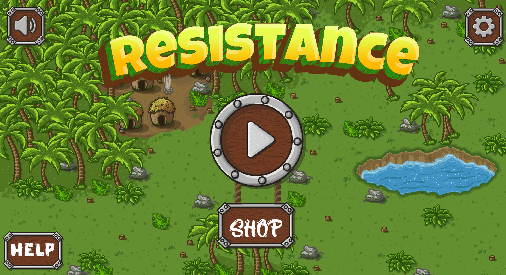
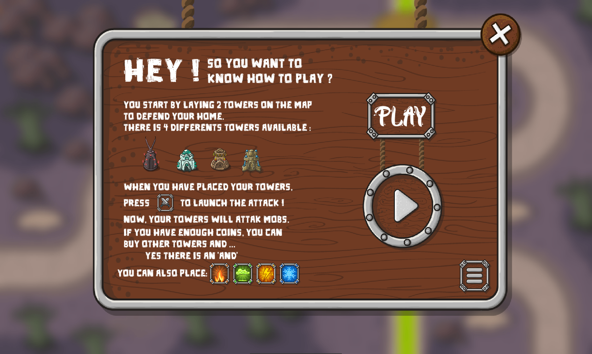
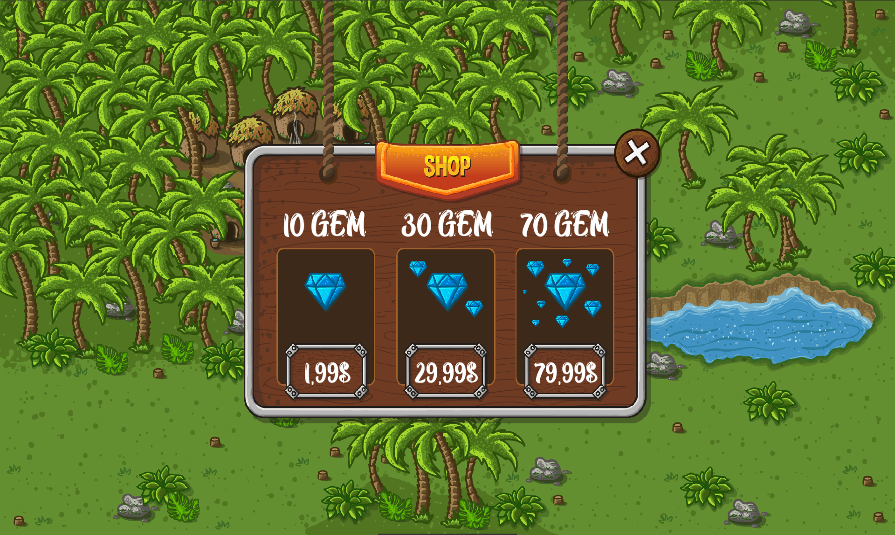
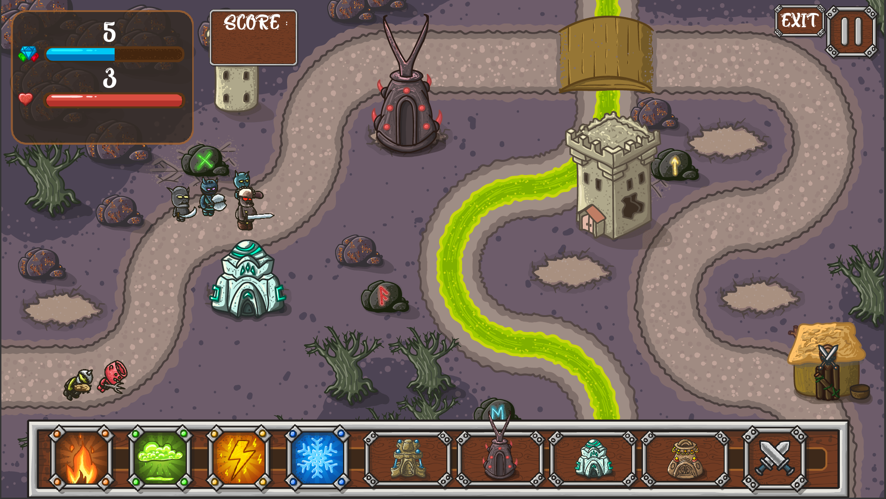

# My Defender 🏰

Welcome to **My Defender**.

A Tower Defense game developed in C.

Drawing inspiration from classics like Revenge of the Titans, this project challenges you to create an engaging and smoothly-operating user interface along with exciting gameplay mechanics.

## Language and Tools 🛠️

- **Language:** C
- **Framework:** SFML (Simple and Fast Multimedia Library)
- **Compilation:** Via Makefile, including `re`, `clean`, and `fclean` rules.
- **Binary Name:** my_defender

## Project Overview 🔎

**My Defender** tasks players with defending a castle from waves of enemies. Players can buy and place various types of buildings, like offensive towers or defensive walls, to protect their castle. Attention to user interface quality and game mechanics is crucial in this project.

## Game Features 🎮

- **Core Mechanics:** Build and manage defenses to protect your castle from enemy waves. Employ strategic placement and use of different defensive and offensive structures to survive each wave.
- **Building Types:** At least four different types of buildings, each with unique functions and powers. This includes offensive towers for attacking enemies and defensive walls to block advances.
- **Input Management:** Robust support for mouse click and keyboard interactions. Features intuitive drag-and-drop mechanics for placing and managing towers, offering a seamless and engaging user experience.
- **Power Management:** Implement drag-and-drop functionality to manage and deploy powers efficiently during gameplay. This adds an extra layer of strategy and skill to the game, as players must decide the best placement and timing for using their powers.
- **Visual Elements:** Richly animated sprites and a smooth user interface, bringing the game world to life. Attention to detail in animations and UI design to ensure an immersive gaming experience.
- **Interactive Gameplay:** The game is designed to be interactive and engaging, with dynamic environments, changing enemy tactics, and various in-game events to keep the gameplay fresh and challenging.

## Gameplay 🕹️

Strategically place a variety of buildings on the grid to fend off enemies. Each building has unique attributes, requiring thoughtful placement and strategy to defend your castle effectively.

## Game Preview 📸

*Get a glimpse of the strategic depth and visual appeal in My Defender.*

## Installation and Usage 💾

1. Clone the repository.
2. Compile the game using `make`.
3. Launch the game: `./my_defender`.
4. Refer to `my_defender.pdf` for detailed guidelines.

## License ⚖️

This project is released under the MIT License. See `LICENSE` for more details.
